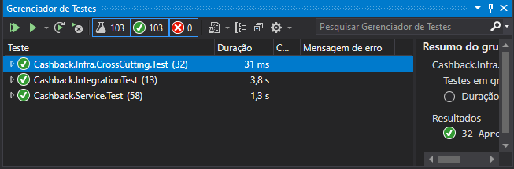

# cashback-api

#### Rota para cadastrar um novo revendedor(a) exigindo no mínimo nome completo, CPF, e- mail e senha
[POST] api/v1/reseller   

#### Rota para validar um login de um revendedor(a); 
[POST] api/v1/reseller/login   

#### Rota para cadastrar uma nova compra exigindo no mínimo código, valor, data e CPF do revendedor(a). Todos os cadastros são salvos com o status “Em validação” exceto quando o CPF do revendedor(a) for 153.509.460-56, neste caso o status é salvo como “Aprovado”; 
[POST] api/v1/purchaseOrder   

####	Rota para listar as compras cadastradas retornando código, valor, data, % de cashback aplicado para esta compra, valor de cashback para esta compra e status; 
[GET] /api/v1/PurchaseOrder

####	Rota para exibir o acumulado de cashback até o momento
[GET] api/v1/reseller/accumulated

#### Como é calculado o cashback:
Ao exibir o relatorio, é calculado quantas compras foram feitas por mês. É analisado o periodo por mês.

####	Os critérios de bonificação são:
+   Para até 1.000 reais em compras, o revendedor(a) receberá 10% de cashback do valor vendido no período de um mês;
+   Entre 1.000 e 1.500 reais em compras, o revendedor(a) receberá 15% de cashback do valor vendido no período de um mês;
+   Acima de 1.500 reais em compras, o revendedor(a) receberá 20% de cashback do valor vendido no período de um mês. 

## Testes

### Autenticação
O Cadastro de Revendedores e o Login não precisam de autenticação, os demais utilizam JWT

### Logs
Pelo Appsettings é possivel selecionar se deve gravar arquivo com o log e qual o path

### Banco de dados
Utilizando SqlServer via Entity

Para executar, basta satisfazer as dependencias do NuGet, alterar a connection strign no appsettings.json ( o default é "Server=(localdb)\mssqllocaldb;Database=Cashback;Trusted_Connection=True;")

AO executar, as migrations ja vão criar a base e as tabelas

usuário e senha via _seed_ para login: 
+ 15350946056@teste.com.br
+ 15350946056
